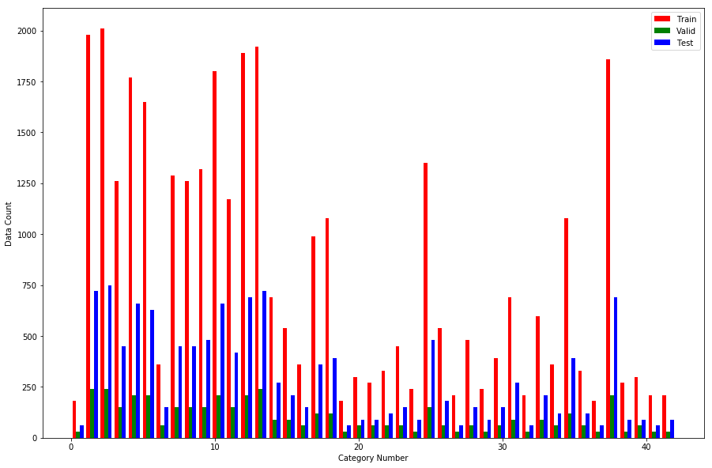
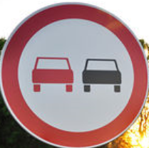
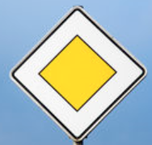
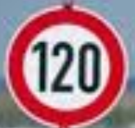
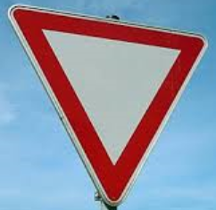
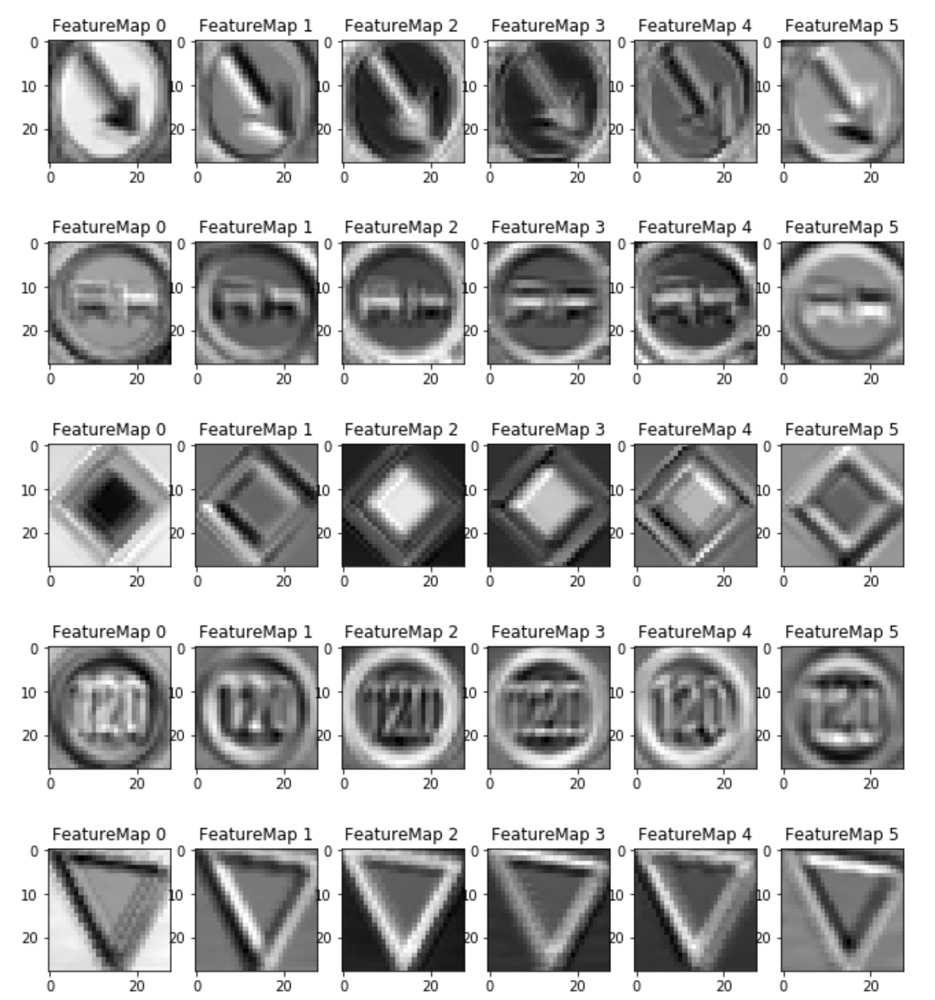

# **Traffic Sign Classifier** 

## Outline

The goals / steps of this project are the following:

* Load the data set (see below for links to the project data set)
* Explore, summarize and visualize the data set
* Design, train and test a model architecture
* Use the model to make predictions on new images
* Analyze the softmax probabilities of the new images
* Summarize the results with a written report

## Detail

This writeup is following this [rublic](https://review.udacity.com/#!/rubrics/481/view).

### Data Set Summary & Exploration

#### 1. Provide a basic summary of the data set. In the code, the analysis should be done using python, numpy and/or pandas methods rather than hardcoding results manually.

I used the pandas library to calculate summary statistics of the traffic
signs data set:

* The size of training set is 34799
* The size of the validation set is 4410
* The size of test set is 12630
* The shape of a traffic sign image is (32, 32, 1)
* The number of unique classes/labels in the data set is 43

#### 2. Include an exploratory visualization of the dataset.

Here is an exploratory visualization of the data set. It is a bar chart showing the distribution of traffic sign classes.

### Design and Test a Model Architecture

#### 1. Describe how you preprocessed the image data. What techniques were chosen and why did you choose these techniques? Consider including images showing the output of each preprocessing technique. Pre-processing refers to techniques such as converting to grayscale, normalization, etc. (OPTIONAL: As described in the "Stand Out Suggestions" part of the rubric, if you generated additional data for training, describe why you decided to generate additional data, how you generated the data, and provide example images of the additional data. Then describe the characteristics of the augmented training set like number of images in the set, number of images for each class, etc.)

I decided to normalize the pixel values between -1 to 1.
I think this effective to keep balance between parameters(weight, bias, rate).

I didn't convert images to grayscale because I thought color information is so important for traffic signs.

#### 2. Describe what your final model architecture looks like including model type, layers, layer sizes, connectivity, etc.) Consider including a diagram and/or table describing the final model.

My final model consisted of the following layers:

|      Layer      |                 Description                 |
|:---------------:|:-------------------------------------------:|
|      Input      |             32x32x3 color image             |
| Convolution 5x5 | 1x1 stride, valid padding, outputs 28x28x6  |
|      RELU       |                                             |
|   Max pooling   |        2x2 stride,  outputs 14x14x6         |
| Convolution 5x5 | 1x1 stride, valid padding, outputs 10x10x16 |
|      RELU       |                                             |
|   Max pooling   |         2x2 stride,  outputs 5x5x16         |
|     Dropout     |                                             |
|     Flatten     |                 outputs 400                 |
| Fully connected |                 outputs 120                 |
|      RELU       |                                             |
|     Dropout     |                                             |
| Fully connected |                 outputs 84                  |
|      RELU       |                                             |
|     Dropout     |                                             |
| Fully connected |                 outputs 43                  |
|     Softmax     |                                             |

#### 3. Describe how you trained your model. The discussion can include the type of optimizer, the batch size, number of epochs and any hyperparameters such as learning rate.

To train the model, I used the Adam optimizer.
Hyperparameters are:

  * batch size = 128
  * number of epochs = 30
  * learning rate = 0.001
  * keep_prob = 0.9  
 
#### 4. Describe the approach taken for finding a solution and getting the validation set accuracy to be at least 0.93. Include in the discussion the results on the training, validation and test sets and where in the code these were calculated. Your approach may have been an iterative process, in which case, outline the steps you took to get to the final solution and why you chose those steps. Perhaps your solution involved an already well known implementation or architecture. In this case, discuss why you think the architecture is suitable for the current problem.

My final model results were:

* training set accuracy of 1.00
* validation set accuracy of 0.95
* test set accuracy of 0.94

I will describe my iterative approach below.

First, I chose LeNet as a baseline because it's famous for classification tasks.
Its accuracy was about 0.90, so it's not enough for requirement.

However, the accuracy of training data was almost 1.00 so I thought it was overfitting.
This is because LeNet doesn't have dropout, so I added dropout after some layers.

When I simply added dropout with keep_prob=0.5, but it doesn't work well.
I think this is because LeNet doesn't have so many layers, so we can't drop so much information.
After some attempts, I found relatively high keep_prob(=0.9) works well.

Finally, I can accomplish the accuracy of 0.94.

### Test a Model on New Images

#### 1. Choose five German traffic signs found on the web and provide them in the report. For each image, discuss what quality or qualities might be difficult to classify.

Here are five German traffic signs that I found on the web:

The fourth image might be difficult to classify because it has characters which indicates the speed limit.

#### 2. Discuss the model's predictions on these new traffic signs and compare the results to predicting on the test set. At a minimum, discuss what the predictions were, the accuracy on these new predictions, and compare the accuracy to the accuracy on the test set (OPTIONAL: Discuss the results in more detail as described in the "Stand Out Suggestions" part of the rubric).

Here are the results of the prediction:

|   Image    | Prediction |
|:----------:|:----------:|
| Keep Right | Keep Right |
| No passing | No passing |
|  Priority  |  Priority  |
|  120 km/h  |  70 km/h   |
|   Yield    |   Yield    |

The model was able to correctly guess 4 of the 5 traffic signs, which gives an accuracy of 80%. This compares favorably to the accuracy on the test set of ...

#### 3. Describe how certain the model is when predicting on each of the five new images by looking at the softmax probabilities for each prediction. Provide the top 5 softmax probabilities for each image along with the sign type of each probability. (OPTIONAL: as described in the "Stand Out Suggestions" part of the rubric, visualizations can also be provided such as bar charts)

The code for making predictions on my final model is located in the cell [11] to [14] of the Ipython notebook.
Except for the fourth image, the model output the probability of nearly 1.00 for correct classes.

For the fourth image, the highest probability was nearly 1.00 as well, but it was wrong.
The following shows the top 5 probabilities.

| Probability |        Prediction         |
|:-----------:|:-------------------------:|
|    0.999    |          70 km/h          |
|    1e-6     | 120 km/h (correct answer) |
|    2e-7     |          20 km/h          |
|    6e-8     |          30 km/h          |
|    5e-19    |         100 km/h          |

The correct answer(120 km/h) has the second highest probability, and all of the top 5 classes are speed limit.

I think I can improve this by adding Character Recognition to my model.

### (Optional) Visualizing the Neural Network (See Step 4 of the Ipython notebook for more details)
#### 1. Discuss the visual output of your trained network's feature maps. What characteristics did the neural network use to make classifications?

The following image is a visualization result of the weights of my model.
It seems that my network use edge information to make classifications.

